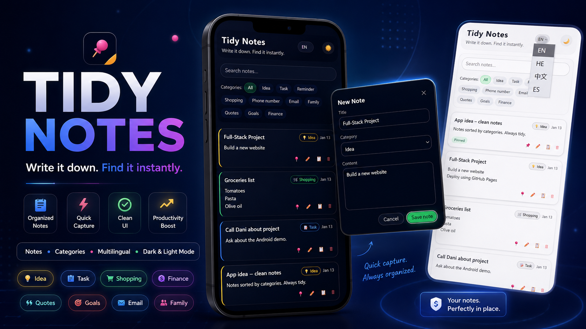
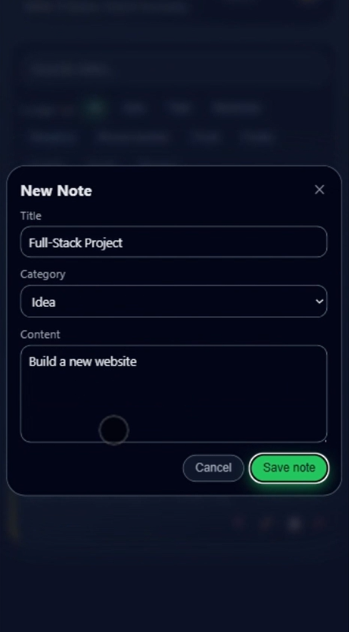
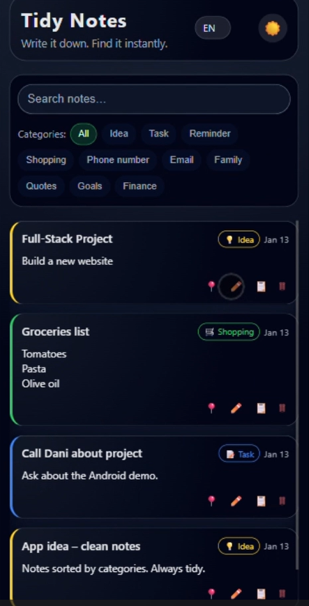
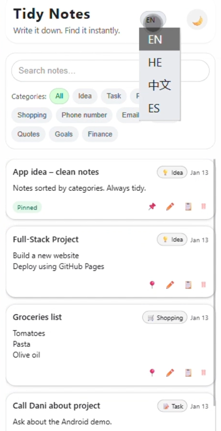

# Tidy Notes Demo

Tidy Notes is a clean, responsive notes app demo built with **HTML**, **CSS**, and **vanilla JavaScript**.

The app helps users quickly create, organize, search, pin, edit, copy, and delete notes using a simple category-based interface. It also includes multilingual UI support, dark/light mode, and browser-based persistence using LocalStorage.

## Live Demo

[Go to link](https://tidy-notes.netlify.app/)

<!-- After enabling GitHub Pages, replace this line with:
https://yonatansherer.github.io/tidy-notes-demo/
-->

## Preview

Add screenshots here after uploading them to the repository.

```md




```

## Features

* Create new notes
* Edit existing notes
* Delete notes with confirmation
* Copy note content to clipboard
* Pin important notes
* Search notes instantly
* Filter notes by category
* Dark and light theme support
* Multilingual interface
* LocalStorage persistence
* Responsive layout for desktop and mobile
* Smooth category selection sheet
* Clean card-based note design

## Supported Languages

The demo currently supports:

* English
* Hebrew
* Chinese
* Spanish

Hebrew includes partial RTL layout support.

## Note Categories

Tidy Notes includes several built-in categories:

* Idea
* Task
* Reminder
* Shopping
* Phone number
* Email
* Family
* Quotes
* Goals
* Finance

Each category has its own icon and visual styling, making notes easier to scan and organize.

## Tech Stack

* HTML5
* CSS3
* JavaScript
* LocalStorage

No frameworks or build tools are required.

## Project Structure

```text
tidy-notes-demo/
│
├── index.html
├── script.js
├── styles.css
└── README.md
```

## How to Run Locally

Clone the repository:

```bash
git clone https://github.com/YonatanSherer/tidy-notes-demo.git
```

Open the project folder:

```bash
cd tidy-notes-demo
```

Then open `index.html` in your browser.

No installation is required.

## What I Learned

While building this project, I practiced:

* Building a complete frontend app with vanilla JavaScript
* Managing application state in the browser
* Saving and loading data with LocalStorage
* Creating reusable rendering logic for dynamic note cards
* Implementing search and category filters
* Supporting multiple interface languages
* Designing responsive layouts
* Improving user experience with modals, floating buttons, and theme switching

## Future Improvements

Planned improvements for a more advanced version:

* User authentication
* Cloud database sync
* Reminder notifications
* Drag-and-drop note ordering
* Export/import notes
* More languages
* Markdown support inside notes
* Tags in addition to categories
* Progressive Web App support
* Better mobile-first navigation

## About the Project

This project started as a simple notes demo and is intended to grow into a more polished productivity app.

It is part of my software engineering portfolio and demonstrates my ability to build functional, user-friendly web applications from scratch.

## Author

Built by **Yonatan Sherer**

* GitHub: [YonatanSherer](https://github.com/YonatanSherer/)
* Portfolio: [See more projects](https://yonatansherer.netlify.app)
* LinkedIn: [Let's connect!](https://www.linkedin.com/in/yonatan-sherer/)
